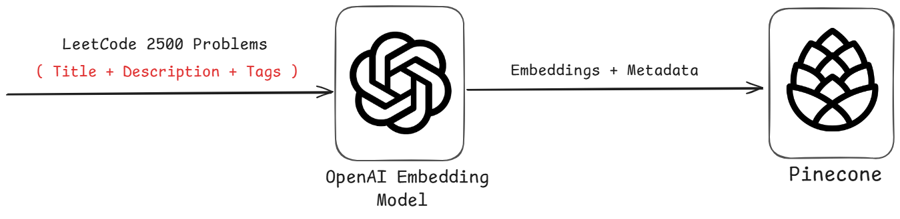
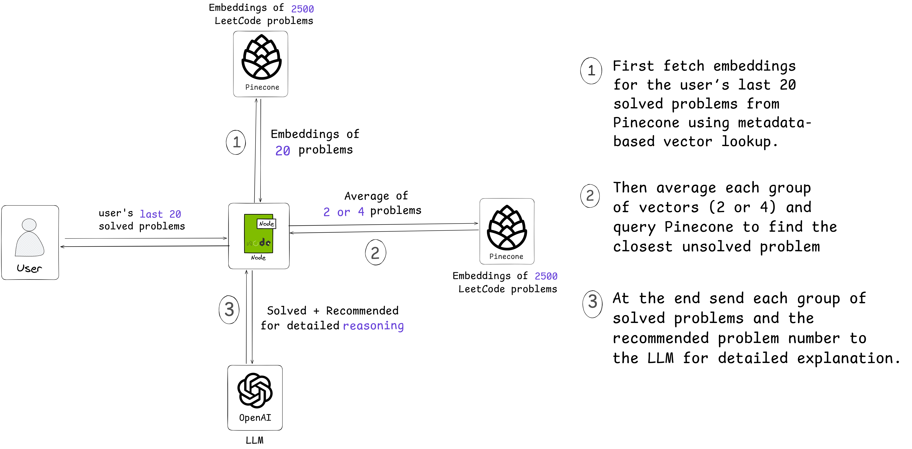

# ✦ Why This Platform Exists

### *LeetCode does not provide personalized problem recommendations based on a user’s solved history, and this SaaS solves that gap by analyzing user's progress and suggesting the most relevant next challenges using AI and semantic search.*

### *Along with recommendations, the platform also generates intelligent hints that explain why a problem is suggested by connecting it to previously solved questions and highlighting the shared patterns, concepts, and techniques.*

&nbsp;

# ✦ Backend Recommendation Architecture

### *LeetCode Problem Embedding Pipeline*
- All LeetCode problems (title, description, difficulty) are preprocessed and converted into vector embeddings using OpenAI embedding model.
- These embeddings are stored in Pinecone for fast semantic search.

  

### *User Progress Ingestion*
- When a user logs in, the system fetches their latest solved problems from their LeetCode profile.
- The most recent **20 solved problems** are selected for generating personalized recommendations.

### *Semantic Recommendation Engine*
- Embeddings of the user’s last 20 problems are used to query Pinecone.
- The system retrieves the **top semantically similar problems** as recommended next challenges.

  

### *Hint & Insight Generation (LLM-Powered)*
- For each recommended problem, the matched problem pairs are passed to the OpenAI LLM .
- The LLM generates detailed reasoning explaining **why this problem is a good next step** based on previously solved patterns, techniques, and concepts.

&nbsp;

# ✦ Tech Stack

### *Frontend (client)*

* Next.js
* React.js
* Firebase (Auth, Firestore, Storage)
* Upstash Redis (REST API)
* Razorpay (Client-side integration)

### *Backend (server)*

* Node.js
* Express.js
* MongoDB + Mongoose
* Firebase Admin SDK
* OpenAI API
* Pinecone Vector Database
* Upstash Redis
* Razorpay SDK

---


This project contains a **Next.js frontend** and a **Node.js backend**, organized inside the root directory:

```
client/   → Next.js (Frontend)
server/   → Node.js (Backend)
```
&nbsp;

# ✦ Setup Instructions


###  Clone the Repository

```bash
git clone https://github.com/Rashid-123/Next_Step
cd Next_Step
```


###  Install Dependencies

#### **Frontend (client)**

```bash
cd client
npm install
```

#### **Backend (server)**

```bash
cd server
npm install
```

&nbsp;

# ✦ Running the Project

### *Frontend*

```bash
cd client
npm run dev
```

Runs on: `http://localhost:3000`

### *Backend*

```bash
cd server
npm start
```

Runs on: `http://localhost:5000` (or your configured port)

&nbsp;

# ✦ Environment Variables

Create separate **.env** files inside both `client` and `server` folders.


##  Client (.env.local)

```
NEXT_PUBLIC_FIREBASE_API_KEY=
NEXT_PUBLIC_FIREBASE_AUTH_DOMAIN=
NEXT_PUBLIC_FIREBASE_PROJECT_ID=
NEXT_PUBLIC_FIREBASE_STORAGE_BUCKET=
NEXT_PUBLIC_FIREBASE_MESSAGING_SENDER_ID=
NEXT_PUBLIC_FIREBASE_APP_ID=
NEXT_PUBLIC_BACKEND_URL=
NEXT_PUBLIC_UPSTASH_REDIS_REST_URL=
NEXT_PUBLIC_UPSTASH_REDIS_REST_TOKEN=

NEXT_PUBLIC_RAZORPAY_KEY_ID=
```

---

##  Server (.env)

```
MONGO_URI=
JWT_SECRET=

FIREBASE_PROJECT_ID=
FIREBASE_CLIENT_EMAIL=
FIREBASE_PRIVATE_KEY=

OPENAI_API_KEY=
PINECONE_API_KEY=
PINECONE_ENVIRONMENT=
PINECONE_INDEX_NAME=

UPSTASH_REDIS_REST_URL=
UPSTASH_REDIS_REST_TOKEN=

RAZORPAY_KEY_ID=
RAZORPAY_KEY_SECRET=
```


#  You're all set!

## Start developing both frontend and backend with hot reload and environment variables configured.

## If you find any bugs or have ideas for improvements, feel free to reach out at **shadanrashid786@gmail.com**.


